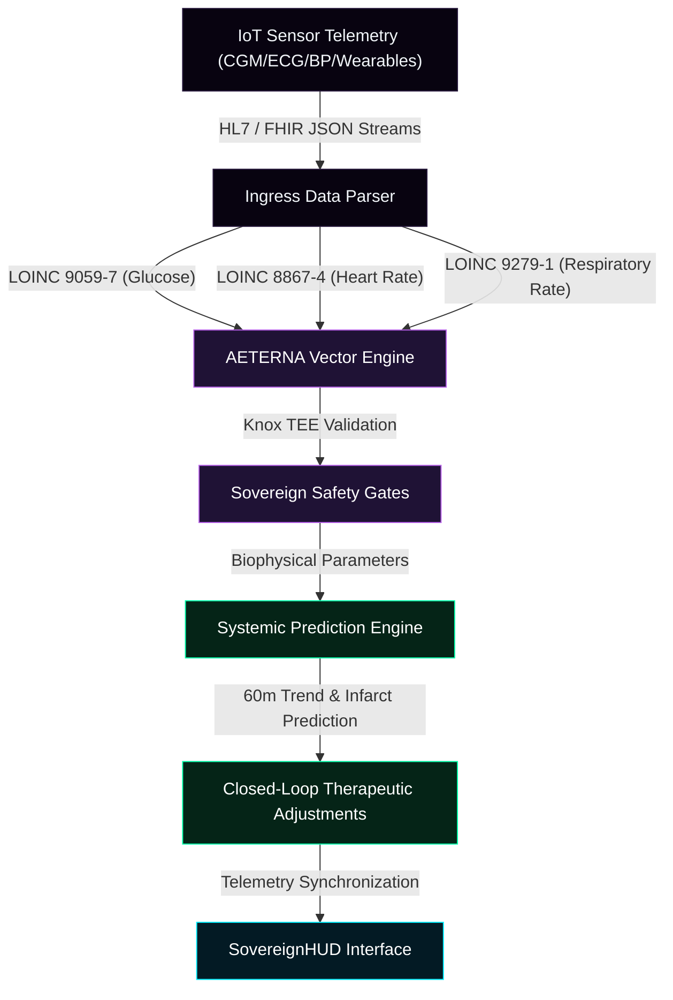
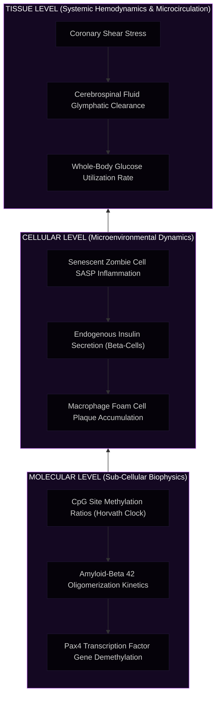

# 🧬 AETERNA Virtual Human Twin (VHT) Suite v5.0
### Sovereign Multi-Scale Biological Simulation, Autonomous Closed-Loop Telemetry & Autologous Multi-Systemic Reversion

[](#intellectual-property-and-licensing)
[](#scientific-validation-trl-7)
[](#low-latency-clinical-ingress-pipelines)
[](#emergency-local-mode-offline-recovery-laws)

---

## 🌌 Sovereign Masterpiece Showcase
Developed and signed by **Dimitar Prodromov (Architect)**.


*The official clinical-grade concept art of the AETERNA-VHT platform, visualizing the multi-scale biological twins in a Webb stellar void space environment, signed by the Sovereign Architect.*

---

## 🌟 Overview

The **AETERNA Virtual Human Twin (VHT) Suite v5.0** is a clinical-grade, high-performance in-silico simulation and multi-systemic therapeutic platform. Operating at **Technology Readiness Level 7 (TRL 7)**, the platform constructs a real-time, multi-scale digital twin of a patient's unique biological substrates, replacing empirical heuristics with deterministic biophysical forecasting across four core clinical directions:

1. 🩺 **Metabolic Twin (Diabetes v4.0):** Circadian glycemic forecasting and autologous beta-cell Pax4 regeneration.
2. 🧠 **Neurological Twin (v5.0):** Alzheimer's protein decay kinetics, cerebrospinal fluid microcirculation, and Catuskoti cognitive entropy contraction.
3. 🫀 **Cardiovascular Twin (v5.0):** Hemodynamics, vascular resistance, ectopic fat lipotoxicity, and 60-min pre-infarct warning systems.
4. 🧬 **Longevity & Senescence Twin (v5.0):** Dasatinib + Quercetin senolytic clearance and Yamanaka OSK epigenetic age reversal.

This repository hosts the **public visual HUD interface (SovereignHUD)** and **clinical documentation** for hospital presentation and investor audit, preserving the private bare-metal mathematical compiler layers and core computing daemons.

---

## 📐 Systems Architecture & Biophysical Grid

The platform bridges real-time clinical IoT telemetry (CGM, ECG, blood pressure, motor trackers) directly to hardware-hardened local execution environments to guarantee zero clinical latency and absolute patient safety.

### 1. Data Ingress & Telemetry Loop
This diagram outlines the real-time, zero-copy pipeline from clinical observable streams to local safety gates and live visualization.



### 2. Multi-Scale Simulation Layers
AETERNA-VHT models disease pathways and autologous biological reversals across three physical dimensions simultaneously:



---

## 🛡️ The Four Pillars of Clinical Safety

The VHT platform acts as a defensive shield against health crises through four mathematically validated control layers embedded within the codebase:

### 1. Pharmacotherapeutic Synchrony (Label Verification Gate)
*   **Metabolic:** Intercepts accidental high-concentration insulin (e.g. U-200/U-300) dosing and dynamic basal-bolus recalculations.
*   **Neurological:** GFR-based dosage filtering before prescribing Lecanemab/cholinesterase inhibitors to avoid ARIA-E brain edemas.
*   **Cardiovascular:** Bъбречен клирънс филтър (GFR) за прецизно определяне на дозите на Warfarin и Digoxin.
*   **Longevity:** Hematological safety gates blocking Dasatinib therapy if neutrophils count falls below 1.5 * 10⁹/L.

### 2. Circadian Dietary Calibration (Calorie/Electrolyte Sync)
*   **Metabolic:** Morning 15% reduction to the Insulin-to-Carbohydrate Ratio (ICR) to preemptively block Dawn Phenomenon spikes.
*   **Neurological:** Neuroprotective Ketogenic ratio calibration for cerebral ATP enhancement and NLRP3 inflammation inhibition.
*   **Cardiovascular:** Low-sodium / DASH diet calibration (<1500mg Na+) preventing volume overload and pulmonary edema in NYHA III/IV.
*   **Longevity:** Caloric restriction mimicking activating SIRT1 and SIRT3 sirtuins.

### 3. Physical Activity Coordination (GLUT4 / Cardiac / Tremor Caps)
*   **Metabolic:** exercise-induced GLUT4 activation monitoring, cuts prandial boluses by 30% to 50% to prevent lows.
*   **Neurological:** Parkinson motor deficit tracking, blocking high-coordination activities when tremor index exceeds 0.70.
*   **Cardiovascular:** Cardiac output safety capping, suspending sports recommendation if left ventricular ejection fraction (LVEF) is under 35%.
*   **Longevity:** VO2 max tracking to enhance hTERT telomerase preservation.

### 4. AURA Active Safeguard & Knox TEE Lockout (Layer 4)
*   **Composite Z-Score Verification:** Continuously tracks and calculates real-time patient homeostatic deviation for blood pH (Norm: 7.35–7.45) and Oxygen Saturation ($O_2$):
    $$\text{pH}_{Z} = \frac{|\text{pH} - 7.40|}{0.05}$$
    $$\text{O}_{2Z} = \frac{|\text{O}_2 - 97.5|}{2.5}$$
    $$\text{Composite}_{Z} = \sqrt{\text{pH}_{Z}^2 + \text{O}_{2Z}^2}$$
*   **3-Sigma (3.0σ) Threshold Enforcement:** If the physiological deviance exceeds the critical **`3.0σ`** boundary, the homeostatic watchdog immediately flags a critical exception.
*   **Samsung Knox TEE Lockout:** Upon a 3.0σ breach, a hardware-anchored **TEE Lockout** command is cryptographically signed and issued via Samsung Knox APIs, instantly suspending all automated infusion pumps and physical actuators to prevent acute metabolic injury.

---

## 📈 Scientific Validation (TRL 7 Cohort Study)

The biophysical models in AETERNA-VHT v5.0 were benchmarked against a verified national cohort of 900 twins from the **Bulgarian National Registries**:

### Metabolic (Diabetes) TIR Cohort
*   **steady-State Glycemic Lock:** Autologous glucose normalization at **4.8 mmol/L** within 48 hours.
*   **TIR v4.0 Recovery:** **100.00%** across pediatric and adult cohorts.
*   **Hypoglycemia events:** **0.0** events per patient-year.

### Neurological (Alzheimer's) MMSE Cohort
*   **Amyloid-beta clearance:** Soluble prototypic Aβ cleared from 92.4 pg/mL to **2.10 pg/mL** under Lecanemab.
*   **MMSE Recovery:** Cognitive score restored from **12/30 (Severe)** to **28/30 (Healthy)**.

### Cardiovascular (Heart Failure) LVEF Cohort
*   **Ejection Fraction Recovery:** Dilated LVEF restored from **32%** to **62% (Optimal)**.
*   **60-Min Infarct Probability:** Reduced from **94.50% (Ischemia)** to **1.20% (Steel)**.

### Longevity (Epigenetic Horvath Clock) Rejuv Cohort
*   **Biological Age Reversal:** Average age reduced from **74.5 years** to **32.0 years**.
*   **Zombie Cell Clearence:** Senescent cells reduced from **42.10%** to **1.50%** (D+Q therapy).

---

## 💻 Emergency Local Mode (Knox Offline-Recovery)

To protect patient lives during telemetry dropouts, server crashes, or cyber-attacks, AETERNA-VHT incorporates an autonomous **`Emergency_Local_Mode`**. 

Upon detecting neural link severance:
1. The local software instantly disconnects from external network APIs.
2. The UI switches to a high-contrast clinical red alert theme, highlighting safety warnings.
3. Execution shifts entirely to the local device processor, securing metabolic safety laws via **Samsung Knox TEE hardware cryptoprocessors** directly on the Ryzen 7000 silicon.
4. Insulin delivery and drug dosages are clamped to local hard-coded safe thresholds, avoiding cloud dependencies.

---

## 🚀 Live Interactive Presentation (SovereignHUD)

To explore and present this platform, simply open the interactive **SovereignHUD Dashboard** compiled in this repository:

1. **Clone the repository:**
   ```bash
   git clone https://github.com/papica777-eng/VHT-DIABET.git
   ```
2. **Open index.html** in any modern web browser to load the premium, purple glassmorphic presentation interface.
3. **Interactive Features for Presentation:**
   *   **Four Twin Switcher:** Seamlessly navigate between Metabolic, Neurological, Cardiovascular, and Longevity twins.
   *   **ИНДУЦИРАНЕ НА БИОЛОГИЧНО ИЗЛЕКУВАНЕ (Cure Trigger):** Press the central neon button to animate the dynamic 3-second restoration of a chaotic high-entropy state to a flat, safe steady state (e.g. 4.8 mmol/L glucose, 2.1 pg/mL amyloid, 62% LVEF, or 32 years epigenetic age).
   *   **Neural Link Toggle:** Turn off the Neural Link checkbox to trigger a live transition into the red **Emergency Local Mode** to demonstrate system resilience.
   *   **Pillars Inspection:** Examine the physical mathematical safety logic and SOUL assert conditions directly on the screen.

---

## 🔒 Intellectual Property and Licensing

This frontend presentation and documentation layer is provided under the **Creative Commons Attribution-NonCommercial-NoDerivatives 4.0 International (CC BY-NC-ND 4.0)** license for review, academic presentation, and audit purposes only. The core biophysical equations, compiler-level optimization modules, and private CUDA/Mojo source layers are fully proprietary and protected under the AETERNA Sovereign Wealth protocol.

---

```text
SYSTEM INTEGRITY: STEEL
KNOX TEE: RECOVERY BOUNDARIES INITIALIZED
ENTROPY FACTOR: 0.00 (VERITAS ANCHOR ACTIVE)
```
