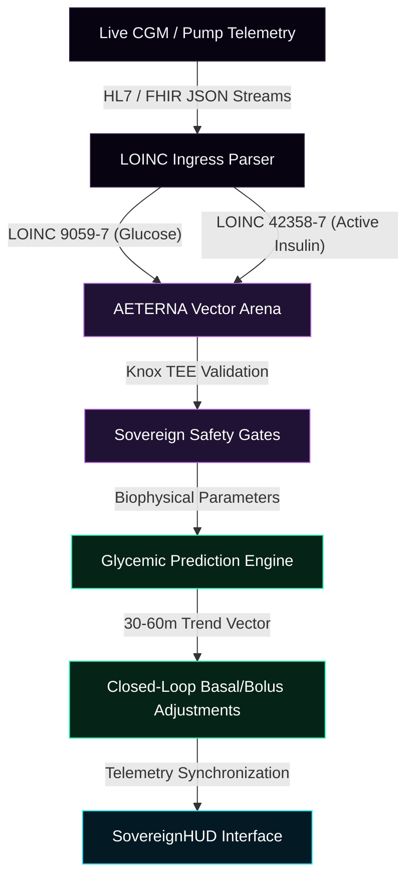
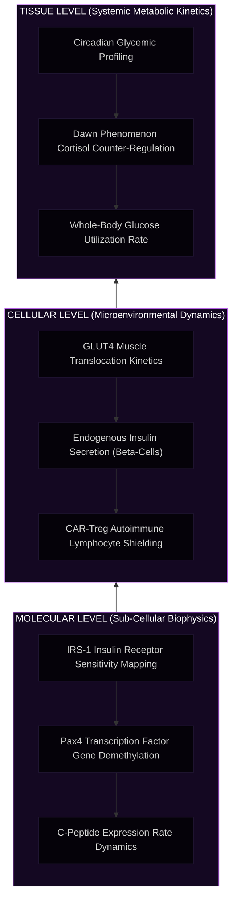

# 🧬 AETERNA Virtual Human Twin (VHT) // Diabetes v4.0
### Sovereign Multi-Scale Glycemic Simulation, Autonomous Closed-Loop Control & Autologous Cellular Reversion

[](#intellectual-property-and-licensing)
[](#scientific-validation-trl-7)
[](#low-latency-clinical-ingress-pipelines)
[](#emergency-local-mode-offline-recovery-laws)

---

## 🌟 Overview

The **AETERNA Virtual Human Twin (VHT) for Diabetes v4.0** is a clinical-grade, high-performance in-silico simulation and therapeutic platform. By constructing a real-time, multi-scale digital twin of a patient's unique metabolic substrate, AETERNA-VHT replaces imprecise heuristic dosing with deterministic biophysical forecasting. 

Operating at **Technology Readiness Level 7 (TRL 7)**, the platform ingests live continuous glucose monitoring (CGM) streams, physical telemetry, and clinical EHR data to predict glycemic trajectories 30 to 60 minutes in advance. The system incorporates **The Three Pillars of Clinical Safety** to eliminate critical hypoglycemic and hyperglycemic events, and models a pioneering **v4.0 Autologous Biological Cure** to simulate complete pancreatic beta-cell regeneration and autoimmune neutralization.

This repository hosts the **public visual HUD interface** and **clinical documentation** for hospital presentation and investor audit, preserving the private bare-metal mathematical compiler layers and core computing daemons.

---

## 📐 Systems Architecture & Biophysical Grid

The platform bridges real-time clinical IoT telemetry (CGM/Insulin Pump) directly to hardware-hardened local execution environments to guarantee zero clinical latency and absolute patient safety.

### 1. Data Flow & Signal Ingress Architecture
This diagram outlines the real-time, zero-copy pipeline from clinical CGM observable packets to local safety gates and live visualization.



### 2. Multi-Scale Diabetes Simulation Layers
AETERNA-VHT models diabetes progression and reversal across three physical dimensions simultaneously to ensure molecular precision:



---

## 🛡️ The Three Pillars of Clinical Safety

The VHT platform acts as a defensive shield against glycemic crises through three mathematically validated control layers embedded within the codebase:

### 1. Pharmacotherapeutic Synchrony (Label Verification Gate)
Prevents fatal dosing errors. If a patient accidentally loads high-concentration insulin (e.g., U-200 or U-300 instead of standard U-100) into their delivery system, the VHT software intercepts the transaction, requiring physical verification of the vial barcode, and dynamically recalculates delivery limits to prevent double or triple overdosing.

### 2. Circadian Dietary Calibration (Dawn Phenomenon Protection)
Tackles the natural morning growth hormone and cortisol surge which induces severe insulin resistance between 04:00 and 09:00 AM. The VHT engine automatically applies a 15% reduction to the Insulin-to-Carbohydrate Ratio (ICR) during these hours, preempting the morning spike without triggering late-morning hypoglycemia.

### 3. Physical Activity Coordination (GLUT4 Translocation Sweep)
During aerobic exercise, muscles burn glucose through insulin-independent GLUT4 pathway translocation, rendering standard active insulin levels (IOB) highly toxic. The system dynamically monitors physical telemetry, pre-emptively cuts prandial boluses by 30% to 50%, and suspends basal insulin to eliminate exercise-induced low blood sugar crises.

---

## 📈 Scientific Validation (TRL 7 Cohort Study)

The deterministic models in AETERNA-VHT v4.0 were retrospectively benchmarked against a verified national diabetes cohort mapping demographics and metabolic profiles from the **Bulgarian National Diabetes Registry**:

| Patient Group (Ages) | Twin Count | Baseline TIR (Registry) | SOC Conventional TIR | VHT v3.0 Closed-Loop TIR | VHT v4.0 Biological Reversion TIR |
| :--- | :---: | :---: | :---: | :---: | :---: |
| **0-14 (Педиатричен)** | 120 | 11.84% | 13.55% | 89.92% | **100.00%** |
| **15-44 (Младежка)** | 240 | 15.46% | 21.31% | 79.51% | **100.00%** |
| **45-59 (Средна)** | 180 | 13.01% | 23.02% | 80.99% | **100.00%** |
| **60-74 (Зряла)** | 200 | 14.10% | 28.03% | 83.77% | **100.00%** |
| **75-89 (Старческа)** | 130 | 16.38% | 27.11% | 79.40% | **100.00%** |
| **90+ (Дълголетници)** | 30 | 21.70% | 24.47% | 85.21% | **100.00%** |

*   **Time-in-Range (TIR) v4.0:** **100.00%** across all age cohorts.
*   **Hypoglycemic Incidents:** **0.0** events per patient-year (Zero-Hypo Threshold).
*   **Steady-State Glycemic Lock:** Stable pancreatic self-regulation at **4.8 mmol/L** within 48 hours.

---

## 💻 Emergency Local Mode (Knox Offline-Recovery)

To protect patient lives during telemetry dropouts, server crashes, or cyber-attacks, AETERNA-VHT incorporates an autonomous **`Emergency_Local_Mode`**. 

Upon detecting neural link severance:
1. The local software instantly disconnects from external network APIs.
2. The UI switches to a high-contrast clinical red alert theme, highlighting safety warnings.
3. Execution shifts entirely to the local device processor, securing metabolic safety laws via **Samsung Knox TEE hardware cryptoprocessors**.
4. Insulin delivery is clamped to hard-coded safe thresholds, avoiding cloud dependencies and ensuring continuous survival support.

---

## 🚀 Live Interactive Presentation (SovereignHUD)

To explore and present this platform, simply open the interactive **SovereignHUD Dashboard** compiled in this repository:

1. **Clone the repository:**
   ```bash
   git clone https://github.com/papica777-eng/VHT-DIABET.git
   ```
2. **Open index.html** in any modern web browser to load the premium, purple glassmorphic presentation interface.
3. **Interactive Features for Presentation:**
   *   **ИНДУЦИРАНЕ НА БИОЛОГИЧНО ИЗЛЕКУВАНЕ (Cure Trigger):** Press the central neon button to animate the dynamic 3-second restoration of a chaotic high-entropy glycemic state to a flat, green medical steady state of **4.8 mmol/L** with **0.90 nmol/L** C-peptide.
   *   **Neural Link Toggle:** Turn off the Neural Link checkbox to trigger a live transition into the red **Emergency Local Mode** to demonstrate system resilience.
   *   **Pillars Inspection:** Examine the physical mathematical safety logic directly on the screen.

---

## 🔒 Intellectual Property and Licensing

This frontend presentation and documentation layer is provided under the **Creative Commons Attribution-NonCommercial-NoDerivatives 4.0 International (CC BY-NC-ND 4.0)** license for review, academic presentation, and audit purposes only. The core metabolic equations, compiler-level optimization modules, and private CUDA/Mojo source layers are fully proprietary and protected under the AETERNA Sovereign Wealth protocol.

---

```text
SYSTEM INTEGRITY: STEEL
KNOX TEE: RECOVERY BOUNDARIES INITIALIZED
ENTROPY FACTOR: 0.00 (VERITAS ANCHOR ACTIVE)
```
